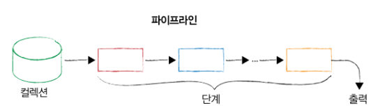
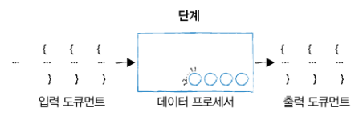
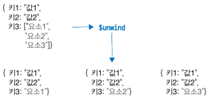

# 집계 프레임워크

## 집계 파이프 라인

집계 프레임워크는 파이프라인 개념을 기반으로 합니다. 모든 단계의 입력과 출력은 문서(도큐먼트) 입니다.



한 번에 입력 문서 스트림을 하나씩 가져와 각 도큐먼트를 하나씩 처리하고, 출력 도큐먼트 스트림을 하나씩 생성합니다.



<br>

## 파이프 라인 단계

`aggregate` 메서드를 사용하여 집계 파이프라인을 실행합니다.

### 일치 (match)

`$match` 스테이지는 입력 문서를 필터링합니다. 일치하는 문서만 파이프라인으로 전달됩니다.

```shell
db.companies.aggregate([
    { $match: { founded_year: 2004 } }
])
```

### 선출 (project)

`$project` 스테이지는 입력 문서의 필드를 추가, 수정, 삭제합니다.

선출 단계는 작업을 수행하고 문서 모양으로 변경 후 출력합니다.

```shell
db.companies.aggregate([
    { $match: { founded_year: 2004 } },
    { $project: { _id: 0, name: 1, founded_year: 1 } } # name, founded_year 필드만 출력합니다.
])
```

### 제한 (limit)

`$limit` 스테이지는 입력 문서의 개수를 제한합니다. 

선출 단계 후에 제한을 적용할수도 있지만 성능상의 이유로 가능하면 먼저 제한을 적용하는 것이 좋습니다.

```shell
db.companies.aggregate([
    { $match: { founded_year: 2004 } },
    { $limit: 5 }, # 5개의 문서만 출력합니다.
    { $project: { _id: 0, name: 1, founded_year: 1 } }
])
```

> 파이프 라인을 구축할 때 한 단계에서 다른 단계로 전달해야 하는 문서 수를 줄이는 것이 중요합니다.

### 정렬 (sort)

`$sort` 스테이지는 입력 문서를 정렬합니다.

```shell
db.companies.aggregate([
    { $match: { founded_year: 2004 } },
    { $sort: { name: 1 } }, # name 필드를 오름차순으로 정렬합니다.
    { $limit: 5 },
    { $project: { _id: 0, name: 1, founded_year: 1 } }
])
```

### 건너뛰기 (skip)

`$skip` 스테이지는 입력 문서에서 처음 몇 개의 문서를 건너뛰고 나머지 문서를 출력합니다.

```shell
db.companies.aggregate([
    { $match: { founded_year: 2004 } },
    { $sort: { name: 1 } },
    { $skip: 5 }, # 처음 5개의 문서를 건너뛰고 나머지 문서를 출력합니다.
    { $limit: 5 },
    { $project: { _id: 0, name: 1, founded_year: 1 } }
])
```

<br>

## $project

서브 도큐먼트나 중첩된 구조를 가진 데이터에서 특정 필드를 상위 레벨로 이동시키는 과정을 중첩 필드의 승격이라고 합니다.

`$project` 스테이지를 사용하여 서브 도큐먼트의 필드를 상위 레벨로 승격 할 수 있습니다.

```shell
db.companies.aggregate([
    { $match: { founded_year: 2004 } },
    { $project: { _id: 0, name: 1, founded_year: 1, funder: "$funding_rounds.investments.financial_org.permalink" } }
])
```

```
{
    "name" : "Facebook",
    "founded_year" : 2004,
    "funder" : [
        [ "greylock", "founders-fund" ],
        [ "accel-partners, " "first-round-capital" ],
        [ "us-venture-partners" ]
    ]
}
```

<br>

## $unwind

`$unwind`를 사용하여 배열을 풀어서 각 배열 요소를 개별 문서로 만들 수 있습니다.



```shell
db.companies.aggregate([
    { $match: { founded_year: 2004 } },
    { $unwind: "$funding_rounds" },
    { $project: { _id: 0, name: 1, amount: "$funding_rounds.raised_amount", year: "$funding_rounds.funded_year" } }
])
```

```
{"name": "Facebook", "amount": 500000, "year": 2004}
{"name": "Facebook", "amount": 12700000, "year": 2004}
{"name": "Facebook", "amount": 27500000, "year": 2004}
{"name": "Digg", "amount": 8500000, "year": 2004 }
```

### 사용시 원치 않는 결과가 출력되는 경우

```shell
db.companies.aggregate([
    { $match: { "funding_rounds.investments.financial_org.permalink" : "greylock" } },
    { $unwind: "$funding_rounds" },
    { $project: { _id: 0, name: 1, funder: "$funding_rounds.investments.financial_org.permalink", amount: "$funding_rounds.raised_amount", year: "$funding_rounds.funded_year" } }
])
```

```
{"name" : "Digg", "funder" : ["greylock", "founders-fund"], "amount" : 8500000, "year" : 2004}
{"name" : "Farecast", "funder" : ["madrona-venture-group", "wrf-capital"], "amount" : 10000000, "year" : 2004} 
{"name" : "Farecast", "funder" : ["greylock", "madrona-venture-group", "wrf-capital"], "amount" : 14000000, "year" : 2006}
```

결과를 보면 greylock이 포함되지 않는 문서가 출력되는 것을 확인할 수 있습니다.

처음의 `$match` 단계에서 "greylock"에 의해 투자 받은 회사들만 필터링을 합니다.

이후 `$unwind` 단계를 거치면서 funding_rounds 배열을 풀어서 개별 문서로 분리할 때 "greylock"이 포함되지 않는 펀딩 라운드 정보도 결과에 포함될 수 있습니다.

일치 작업을 빨리해서 효율성을 찾고 문제를 해결하려면 같은 유형의 단계를 포함하 됩니다.

```shell
db.companies.aggregate([
    { $match: { "funding_rounds.investments.financial_org.permalink" : "greylock" } }, # 성능, 필터링
    { $unwind: "$funding_rounds" },
    { $match: { "funding_rounds.investments.financial_org.permalink" : "greylock" } }, # 필터링
    { $project: { _id: 0, name: 1, funder: "$funding_rounds.investments.financial_org.permalink", amount: "$funding_rounds.raised_amount", year: "$funding_rounds.funded_year" } }
])
```

> 같은 유형의 단계를 여러 개 포함해야 할때가 많습니다.

<br>

## 배열 표현식

### $filter

`$filter` 배열 표현식을 사용하여 배열의 요소를 필터링 할 수 있습니다.

```shell
db.companies.aggregate([
    { $match: { "funding_rounds.investments.financial_org.permalink" : "greylock" } }
    { $project: { 
        _id: 0, 
        name: 1, 
        funding_rounds: { 
            $filter: { 
                input: "$funding_rounds", 
                as: "round", 
                cond: { $gte: ["$$round.raised_amount", 10000000] } 
            } 
        } 
    } },
    { $match: { "funding_rounds.investments.financial_org.permalink" : "greylock" } }
])
```

첫번째 옵션은 필터링할 배열을 지정합니다.

두번째 옵션은 필터링할 배열의 각 요소를 참조할 변수 이름을 지정합니다.

세번째 옵션은 필터링 조건을 지정합니다. 조건을 지정할 때 `$$`를 사용했는데 이는 작업 중인 표현식 내에서 정의된 변수를 참조할 때 사용합니다.

`$match`가 두번 사용된 이유는 `$filter`를 사용하여 배열을 필터링 했을 때 모두 필터링 되어 빈 배열이 된 경우를 제외하기 위해서 입니다.

### `$arrayElemAt`

`$arrayElemAt` 배열 표현식을 사용하여 배열의 요소를 선택할 수 있습니다.

```shell
db.companies.aggregate([
    { $match: { founded_year: 2004 } },
    { $project: { 
        _id: 0, 
        name: 1, 
        first_round: { 
            $arrayElemAt: ["$funding_rounds", 0]
        },
        last_round: { 
            $arrayElemAt: ["$funding_rounds", -1]
        }
    } }
])
```

```
{
    "name" : "Facebook",
    "first_round" : {
        "id" : 1,
        "round_code" : "angel",
        "raised_amount" : 500000,
        "funded_year" : 2004
    },
    "last_round" : {
        "id" : 3,
        "round_code" : "series-b",
        "raised_amount" : 27500000,
        "funded_year" : 2006
    }
}
```

배열의 첫번째 요소와 마지막 요소를 선택하여 출력합니다.

### `$slice`

`$slice` 배열 표현식을 사용하여 배열의 특정 인덱스에서 시작해 여러 항목을 순서대로 반환할 수 있습니다.

`$slice: [배열, 개수]` - 배열의 시작부터 지정된 개수의 요소를 추출합니다. 여기서 개수가 양수이면 배열의 시작부터, 음수이면 배열의 끝부터 요소를 세어 추출합니다.

`$slice: [배열, 시작 인덱스, 개수]` - 배열에서 시작 인덱스를 기준으로 지정된 개수의 요소를 추출합니다. 이 형태에서 시작 인덱스는 0부터 시작합니다.

```shell
db.companies.aggregate([
    { $match: { founded_year: 2004 } },
    { $project: { 
        _id: 0, 
        name: 1, 
        first_five_rounds: { 
            $slice: ["$funding_rounds", 1, 2] # 인덱스 1부터 2개의 요소를 추출합니다. (인덱스 1, 인덱스 2)
        }
    } }
])
```

```
{
    "name" : "Facebook",
    "first_five_rounds" : [
        {
            "id" : 2,
            "round_code" : "series-a",
            "raised_amount" : 12700000,
            "funded_year" : 2005
        },
        {
            "id" : 3,
            "round_code" : "series-b",
            "raised_amount" : 27500000,
            "funded_year" : 2006
        }
    ]
}
```

### `$size`

`$size` 배열 표현식을 사용하여 배열의 길이를 반환할 수 있습니다.

```shell
db.companies.aggregate([
    { $match: { founded_year: 2004 } },
    { $project: { 
        _id: 0, 
        name: 1, 
        total_rounds: { $size: "$funding_rounds" }
    } }
])
```

```
{
    "name" : "Facebook",
    "total_rounds" : 3
}
```

<br>

## 누산기

집계 프레임워크에서 누산기 연산자는 여러 문서의 데이터를 합치거나 요약하는 데 사용됩니다.

집계 프레임워크가 제공하는 누산기를 사용하면 특정 필드의 모든 값 합산(`$sum`), 평균(`$avg`), 최대값(`$max`), 최소값(`$min`)을 계산할 수 있습니다. (하나의 값만을 저장하거나 반환)

`$first`, `$last`도 누산기로 간주되는데 모든 도큐먼트 내 값을 고려하기 때문입니다. (그룹 내의 모든 문서를 순회하고 검토하여, 그 결과로 첫 번째나 마지막 문서의 값을 선택한다는 의미)

### 선출 단계에서 누산기 사용

몽고DB 3.2 이전에는 누산기를 그룹 단계에서만 사용할 수 있었지만 3.2 이후부터는 선출 단계(`$project`)에서도 사용할 수 있습니다.

선출 단계에서 누산기는 배열값 필드에서 작동해야 합니다.

```shell
db.companies.aggregate([
    { $match: { founded_year: 2004 } },
    { $project: { 
        _id: 0, 
        name: 1, 
        average_round: { $avg: "$funding_rounds.raised_amount" } 
    } }
])
```

```
{
    "name" : "Facebook",
    "average_round" : 15066666.666666666
}
```

### $mergeObject

`$mergeObject`는 여러 도큐먼트를 하나의 도큐먼트로 결합합니다. (누산기 연산자는 아닙니다.)

```json
{
  "document1": {
    "name": "John",
    "age": 30
  },
  "document2": {
    "age": 25,
    "city": "New York"
  }
}
```

```shell
db.collection.aggregate([
  {
    $replaceRoot: {
      newRoot: {
        $mergeObjects: ["$document1", "$document2"]
      }
    }
  }
])
```

```
{
  "name": "John",
  "age": 25,
  "city": "New York"
}
```

<br>

## 그룹화

그룹 단계는 SQL의 `GROUP BY`와 유사합니다.

`$group` 스테이지를 사용하여 그룹화를 수행합니다.

그룹 단계에서는 여러 도큐먼트의 값을 집계하고 집계한 값에 평균 계산과 같은 집계 작업을 수행할 수 있습니다.

```shell
db.companies.aggregate([
    { $group: { 
        _id: { founded_year: "$founded_year" }, 
        total_raised: { $sum: "$funding_rounds.raised_amount" } 
    } },
    sort: { total_raised: -1 }
])
```

```
{ "_id" : { "founded_year" : 2004 }, "total_raised" : 4525000 }
{ "_id" : { "founded_year" : 2005 }, "total_raised" : 388800 }
```

`founded_year`에 대해 동일한 값을 갖는 모든 문서를 단일 그룹으로 취급합니다.

### 그룹 단계의 _id 필드

`$group`에서 _id 필드는 그룹화의 기준이 되는 필드를 지정합니다.

```shell
db.companies.aggregate([
    { $group: { 
        _id: { founded_year: "$founded_year" }, 
        companies: { $push: "$name" } 
    } },
    sort: { "_id.founded_year": 1 }
])
```

```
{ "_id" : { "founded_year" : 2004 }, "companies" : [ "Facebook", "Digg", "Farecast" ] }
{ "_id" : { "founded_year" : 2005 }, "companies" : [ "StumbleUpon", "Technorati" ] }
```

`_id` 객체 내에 founded_year라고 레이블링된 필드를 사용하는 이유는, 단순히 숫자 값을 그룹화의 기준으로 사용하는 것보다 더 명시적이기 때문입니다. 

즉, `_id`에 `{ founded_year: "$founded_year" }` 형태로 명시함으로써, 해당 그룹의 기준이 '설립 연도'임을 분명히 하는 것입니다.

**잘못된 예시**

```shell
db.companies.aggregate([
    { $group: { 
        _id: "$founded_year", 
        companies: { $push: "$name" } 
    } },
    { $sort: { "_id": 1 } }
])
```

```
{ "_id" : 2004, "companies" : [ "Facebook", "Digg", "Farecast" ] }
{ "_id" : 2005, "companies" : [ "StumbleUpon", "Technorati" ] }
```

**여러 필드로 구성된 _id**

여러 필드가 있는 도큐먼트를 그룹 단계에서 `_id` 값으로 사용하면 전혀 문제가 없습니다.

```shell
db.companies.aggregate([
    { $group: { 
        _id: { founded_year: "$founded_year", category_code: "$category_code" }, 
        companies: { $push: "$name" } 
    } },
    { $sort: { "_id.founded_year": 1 } }
])
```

```
{ "_id" : { "founded_year" : 2004, "category_code" : "web" }, "companies" : [ "Facebook", "Digg", "Farecast" ] }
{ "_id" : { "founded_year" : 2005, "category_code" : "web" }, "companies" : [ "StumbleUpon", "Technorati" ] }
```

**내장 도큐먼트의 필드를 그룹화의 기준으로 사용**

내장 도큐먼트 내의 필드를 그룹화 기준으로 사용할 경우, 해당 필드에 접근하기 위한 전체 경로를 그룹 단계에서 그룹화할 값으로 사용하는 것이 일반적입니다.

이 방법은 내장 도큐먼트의 특정 필드 값을 기준으로 문서들을 그룹화하고자 할 때 필요한 접근 방식입니다.

```shell
db.companies.aggregate([
    { $group: { 
        _id: { ipo_year: "$ipo.pub_year" },
        companies: { $push: "$name" }
    } },
    { $sort: { "_id.ipo_year": 1 } }
])
```

```
{ "_id" : { "ipo_year" : 2004 }, "companies" : [ "Facebook", "Digg", "Farecast" ] }
{ "_id" : { "ipo_year" : 2005 }, "companies" : [ "StumbleUpon", "Technorati" ] }
```

<br>

## 집계 파이프라인 결과를 컬렉션에 쓰기

집계 파이프라인에서 생성된 도큐먼트를 컬렉션에 쓸 수 있는 단계로 `$out`과 `$merge`가 있습니다.

두 단계 중 하나만 쓸 수 있으며, 집계 파이프라인의 마지막 단계여야 합니다.

`$merge`는 컬렉션에서 쓰기를 수행할 때 선호되는 방법입니다.

`$out`은 동일한 데이터베이스에만 쓸 수 있고 기존 컬렉션이 있으면 덮어쓰며, 샤딩된 컬렉션에는 사용할 수 없습니다.

`$merge`는 기존 컬렉션으로 작업할 때 결과를 통합할 수도 있습니다. (새 도큐먼트 삽입, 기존 도큐먼트 병합 등)

### $merge의 진정한 장점

집계 파이프라인을 실행할 때마다 출력 컬렉션(즉, 결과가 저장되는 컬렉션)의 데이터를 실시간으로 업데이트하거나 추가하는 것이 가능 한것이 `$merge`의 진정한 장점입니다.

즉, `$merge`를 통해 새로운 데이터가 들어올 때마다 집계를 실행하여 결과를 컬렉션에 저장함으로써 데이터의 최신 상태를 반영한 요약 정보를 쉽게 관리하고 접근할 수 있게 됩니다.

예를 들어, 매일 많은 양의 거래 데이터가 쌓이는 온라인 쇼핑몰이 있다고 가정해 봅시다. 

이 경우, $merge를 사용하여 매일 거래 데이터를 집계하고, 그 결과를 별도의 컬렉션에 저장할 수 있습니다. 

이렇게 하면, 매일의 거래 요약 정보가 저장된 컬렉션을 바로 조회하여 최신 거래 동향을 파악할 수 있습니다. 

데이터가 새롭게 업데이트될 때마다 이 요약 컬렉션도 자동으로 갱신되기 때문에, 항상 최신 상태의 데이터 뷰를 유지할 수 있습니다.

### $out 

`$out`은 집계 결과를 지정된 컬렉션에 저장하지만, 이 과정에서 대상 컬렉션의 기존 내용은 완전히 대체됩니다. 

즉, $out을 사용하면 매번 집계를 실행할 때마다 대상 컬렉션의 이전 내용은 삭제되고 새로운 집계 결과로 전체가 교체됩니다. 
