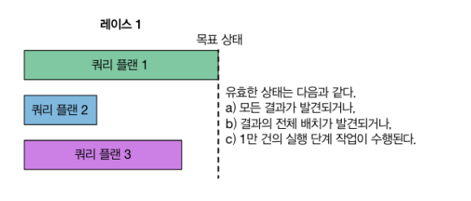

# 복합 인덱스

## 개념

상당 수의 쿼리 패턴은 두개 이상의 키를 기반으로 인덱스를 작성해야 합니다.

복합 인덱스는 2개 이상의 필드로 구성된 인덱스로 쿼리에서 정렬이나 검색 조건이 여러 개 있을 때 유용 합니다.

## 성능 비교

### 복합 인덱스 적용 전 성능 체크

```shell
db.users.createIndex({"username" : 1})
```

```shell
db.users.find().sort({"age" : 1, "username" : 1}).explain("executionStats") 
# executionTimeMillis: 4459
```

"age"로 정렬한 후 "username"으로 정렬하는데 기존 인덱스는 별로 도움이 되지 않습니다.

해당 쿼리를 최적화하려면 "age"와 "username"을 기반으로 `복합 인덱스`를 생성해야 합니다.

### 복합 인덱스 적용 후 성능 체크

```shell
db.users.createIndex({"age" : 1, "username" : 1}) 
```

```shell
db.users.find().sort({"age" : 1, "username" : 1}).explain("executionStats")
# executionTimeMillis: 1772
```

복합 인덱스를 사용하여 쿼리 시간이 4459초에서 1772초로 줄어든 것을 확인할 수 있습니다.

### 중간 질문

**Question**

`{ "age" : 1, "username" : 1 }` 과 `{ "gender" : 1, "username" : 1}` 복합 인덱스가 존재할 때 정렬이 "age" : 1, "gender" : 1 인 경우 어떻게 처리합니까?

**Answer**

<details>
<summary>답변</summary>

   ㅇㅇㅇㅇㅇ

</details>


> 
> 
> Answer  
> MongoDB의 인덱스는 왼쪽에서 오른쪽으로 방향성을 가집니다.  
> 따라서 첫번째 정렬 조건과 일치하는 `{ "age" : 1, "username" : 1}` 인덱스를 사용할 것입니다.
> 그러나 gender에 대해서는 추가적인 필터링 작업을 수행해야합니다.  
> 최적의 성능을 위해서는 
> 
> 
>
> A. 아니요. 인덱스를 타지않고 해당 조건에 인덱스를 적용하고 싶다면 새로운 인덱스를 생성해야 합니다.

### 인덱스 형태

컬렉션에 `{"age" : 1, "username" : 1}`로 인덱스를 만들면 다음과 같은 형태로 표현됩니다.

```
# 가상으로 표현
[0, "user100020"] -> 8623513776
[0, "user1002"] -> 8599246768
[0, "user100388"] -> 862350880

...

[1, "user100113"] -> 8623513208
[1, "user100280"] -> 8599246405
[1, "user100388"] -> 8623581744

...

[30, "user100626"] -> 8623513745
[30, "user1002"] -> 85992467200
[30, "user100388"] -> 862350140
```

각 인덱스 항목은 나이와 사용자명을 포함하고 레코드 식별자를 가리킵니다.

레코드 식별자는 내부에서 스토리지 엔진에 의해 사용되며 도큐먼트 데이터를 찾습니다.

몽고DB가 실행하는 쿼리 종류에 따라 인덱스를 사용하는 방법이 다릅니다. 가장 많이 사용하는 세가지 방법을 살펴보겠습니다.

### 1. 동등 쿼리

```shell
# 1
db.users.find({"age" : 21}).sort({"username" : -1})
```

단일값을 찾는 동등 쿼리 입니다.

> 단일 값 : 하나의 필드 `age`가 하나의 특정 값 `21`을 기준으로 설정하여 단일값이라고 표현  
> 동등 쿼리 : 주어진 값과 정확히 일치하는 문서를 찾는 쿼리를 의미

```shell
[21, "user100154"] -> 8623513723
[21, "user100266"] -> 8599246414
```

MongoDB는 `{"age" : 21}`과 일치하는 마지막 항목부터 순서대로 인덱스를 탐색합니다.

MongoDB는 인덱스를 어느 방향으로도 쉽게 탐색하므로 정렬 방향은 문제가 되지 않습니다.

### 2. 범위 쿼리

```shell
# 2
db.users.find({"age" : {"$gte" : 21, "$lte" : 30}})
```

> 범위 쿼리 : 주어진 범위 내의 값과 일치하는 문서를 찾는 쿼리를 의미

인덱스에 있는 첫번째 키인 "age"를 사용해 범위 쿼리를 수행합니다.

`{"age" : 1, "username" : 1}` 인덱스는 age 필드와 username 필드를 포함하므로, age 필드를 사용하는 이 쿼리는 이 인덱스를 사용할 수 있습니다.

```shell
[21, "user100154"] -> 8623513723
[21, "user100266"] -> 8599246414
# ...
[30, "user100154"] -> 8623513723
[30, "user100266"] -> 8599246414
```

### 3. 다중 값 쿼리와 정렬

```shell
db.users.find({"age" : {"$gte" : 21, "$lte" : 30}}).sort({"username" : 1})
```

인덱스 `{"age": 1, "username": 1}`를 사용할 경우, age 조건에 맞는 문서를 효율적으로 찾을 수 있지만,
사용자명(username)에 대해서는 추가적인 메모리 내 정렬이 필요할 수 있습니다.

반대 순서인 인덱스 `{"username" : 1, "age" : 1}`를 사용하면, username을 기준으로 이미 정렬된 상태에서 나이 조건을 만족하는 문서를 효율적으로 필터링 할 수 있습니다.

원하는 순서로 정렬된 결과를 바로 반환할 수 있으며, 대규모 메모리 내 정렬을 피할 수 있지만 전체 인덱스를 탐색 해야합니다.

```shell
[user0, 4]
[user1, 67]
# ...
[user10000, 21] -> 8623513723
# ...
[user100001, 52]
[user100002, 21] -> 8623513723
[user100003, 27] -> 8599246414
```

### 성능 최적화

대부분의 어플리케이션에서는 데이터셋의 크기가 크고 계속 증가하는 경우가 많습니다.

따라서 복합 인덱스를 구성할 때는 정렬 키를 첫번째에 놓는 방법을 사용하면 좋은 성능 최적화 방법 중 하나입니다.

<br>

## MongoDB가 인덱스를 선택하는 방법

### 순서

5개의 인덱스가 있다고 가정하겠습니다.

1. 쿼리가 들어오면 MongoDB는 **쿼리 모양**을 확인하게 됩니다.

   > 쿼리 모양은 검색할 필드, 정렬 여부 등 여러 정보와 관련이 있습니다.

2. 해당 정보를 기반으로 인덱스 후보 집합을 식별합니다. (3개 인덱스가 후보 집합이 되었다고 가정하겠습니다)


3. MongoDB는 인덱스 후보 마다 쿼리 플랜을 만들고(3개) 병렬 스레드(3개)에서 실행합니다.

    - 어떤 스레드가 가장 빨리 결과를 반환하는지 확인하기 위해 경쟁을 합니다.


4. 가장 먼저 목표 상태에 도달하는 쿼리 플랜이 선택됩니다.

    - 병렬 스레드에서 실행하여 반환할 떄까지 기간을 `시범 기간`이라고 합니다.


5. 승리한 플랜은 다음번 모양이 같은 쿼리에서 사용하기 위해 캐시에 저장됩니다.

    - 앞으로 동일한 모양을 가진 쿼리는 캐시된 플랜을 사용하여 더 빠르게 실행됩니다.



### 쿼리 플랜 캐시 제거

컬렉션과 인덱스가 변경되면 쿼리 플랜이 캐시에서 제거됩니다.

MongoDB는 다시 가능한 쿼리 플랜을 실험해 해당 컬렉션 및 인덱스 집합에 가장 적합한 플랜을 찾습니다.

또한 인덱스를 다시 작성하거나 추가, 삭제 하면 쿼리 플랜이 캐시에서 제거됩니다.

쿼리 플랜 캐시는 명시적으로 지울 수 있으며 mongod 프로세스를 다시 시작할 때도 삭제됩니다.

<br>

## 읽기와 쓰기를 가능한 효율적으로 수행하는 인덱스 설계

인덱스를 올바르게 설계하려면 인덱스를 테스트하고 조정해야 하지만 몇가지 모범 사례를 적용해볼 수 있습니다.

### 특수한 복합 인덱스

필터링 대상 필드 중 하나를 기준으로 정렬하는 복합 인덱스가 특수 복합 인덱스입니다.

`선택성`이란 인덱스에서 얼마나 많은 데이터를 효과적으로 필터링할 수 있는지를 나타냅니다.

```shell
const batchSize = 1000;
let batch = [];
const scoreTypes = ["exam", "quiz", "homework", "homework"]; 

for (let i = 0; i < 1000000; i++) {
  let scores = scoreTypes.map(type => ({
    type: type,
    score: parseFloat((Math.random() * 100).toFixed(14)) 
  }));
  
  const document = {
    student_id: i,
    class_id: Math.floor(Math.random() * 501), 
    scores: scores
  };

  batch.push(document);

  if (batch.length === batchSize) {
    db.students.insertMany(batch);
    batch = [];
  }
}

if (batch.length > 0) {
  db.students.insertMany(batch);
}
```

```shell
# 100만개의 학생 데이터셋
[
  {
    _id: ObjectId('65e473ca2ca178def2c85297'),
    student_id: 19,
    class_id: 371,
    scores: [
      { type: 'exam', score: 51.80624107950489 },
      { type: 'quiz', score: 64.44871547516604 },
      { type: 'homework', score: 46.75760678103447 },
      { type: 'homework', score: 44.85046424076016 }
    ]
  }
  # ...
]

# 인덱스
db.students.createIndex({"class_id" : 1})
db.students.createIndex({"student_id" : 1, "class_id" : 1})
```

```shell
# ID가 500000보다 큰 모든 레코드에서 class_id가 54인 레코드를 찾고, student_id로 오름차순 정렬합니다.
db.students.find({"student_id" : { "$gt" : 500000}, "class_id" : 54}).sort({"student_id" : 1}).explain("executionStats")
```

> MongoDB 7 버전 이상에서는 책과 다르게 기본적으로 class_id의 인덱스를 사용했습니다.  
> nReturned: 992, executionTimeMillis: 8
>
> hint()를 사용해 `{ "student_id" : 1, "class_id" : 1 }` 인덱스를 사용하도록 강제 하였을 때 결과는 아래와 같습니다.
> nReturned: 992, executionTimeMillis: 536, rejectedPlans: []
>
> 밑에는 학습을 위해 책의 내용을 바탕으로 진행하겠습니다.


```shell
executionStats: {
    nReturned: 9903, # 반환 받은 결과의 개수
    executionTimeMillis: 4325, # 쿼리하는데 걸린 시간 (4.3초)
    totalKeysExamined: 850477, # 인덱스를 탐색한 횟수
}
```

`toalKeysExamined`를 `nReturned`와 비교하면 얼마나 많은 인덱스를 통과했는지 알 수 있습니다.

예시에서는 9903개의 문서를 찾기위해 850477개의 인덱스를 탐색했는데 이는 사용된 인덱스가 선택성이 높지 않음을 의미합니다.

즉, 데이터 필터링이 잘못되었다는 의미이고, 시간도 4.3초나 걸린것을 확인할 수 있습니다.


> MongoDB 7 버전 이상에서 결과를 알려드리겠습니다.
> ```shell
> db.students.find({"student_id" : { "$gt" : 500000}, "class_id" : 235}).sort({"student_id" : 1}).explain("executionStats")
> 
> executionStats: {
>   nReturned: 1039,
>   executionTimeMillis: 8,
>   totalKeysExamined: 2139,
> }
> ```
>
> 만약 책의 예시와 동일한 인덱스를 선택하면 마찬가지로 선택성이 높지 않은 것을 확인할 수 있습니다.
>
> ```shell
> db.students.find({"student_id" : { "$gt" : 500000}, "class_id" : 235}).sort({"student_id" : 1}).hint('student_id_1_class_id_1').explain("executionStats")
> 
> executionStats: {
>   nReturned: 1039, 
>   executionTimeMillis: 551,
>   totalKeysExamined: 499999,
> }
> ```

```shell
winningPlan: { # 선정된 쿼리 플랜
    stage : "FETCH",
    inputStage : {
        stage : "IXSCAN", # 인덱스 스캔
        keyPattern : {"student_id" : 1, "class_id" : 1},
    }
}
```

선정된 쿼리 플랜을 살펴보면 student_id와 class_id를 기반으로 복합 인덱스를 사용했음을 알 수 있습니다.

explain 출력은 쿼리 플랜을 단계 트리로 표시하기 때문에 각 단계에는 하위 단계 개수에 따라 하나 이상의 입력 단계가 있을 수 있습니다.

예시에서는 입력 단계인 인덱스 스캔이 하나 있고 해당 스캔은 쿼리와 일치하는 문서의 레코드ID를 상위 단계인 FETCH에 제공했습니다.

FETCH 단계에서는 문서를 검색하고 클라이언트가 요청하면 일괄적으로 반환합니다.

```shell
rejectedPlans: [ # 거부된 쿼리 플랜
    {
        stage : "SORT",
        sortPattern : {"student_id" : 1},
    }
]
```

실패한 쿼리플랜에 SORT 단계가 표시된다면 정렬할 때 인덱스를 사용하지 못했고 인메모리 정렬을 수행했음을 알 수 있습니다.

```shell
db.students.find({"student_id" : { "$gt" : 500000}, "class_id" : 54}).sort({"student_id" : 1}).explain("executionStats")
```

다중값 조건(`"$gt": 500000`) 은 student_id 필드에 대해 넓은 범위를 탐색합니다. 이는 많은 레코드를 대상으로 하며, 데이터셋의 큰 부분을 포함할 수 있습니다.

동등 조건(`"class_id": 54`) 은 특정 class_id 값을 가진 레코드를 정확히 지정하는 좁은 범위의 검색입니다. 이는 비교적 적은 수의 레코드를 대상으로 합니다.

동등 조건을 사용하는 쿼리가 다중값 조건을 사용하는 쿼리보다 일반적으로 더 효율적으로 인덱스를 활용할 수 있습니다. 특히, 해당 동등 조건("class_id": 54)이 포함된 인덱스가 있다면, MongoDB는 이 인덱스를 사용하여 빠르게 필요한 레코드를 찾을 수 있습니다.

결론적으로, class_id를 기준으로 한 검색이 student_id를 기준으로 한 검색보다 효율적일 가능성이 높습니다. 이는 class_id에 대한 동등 조건이 더 좁은 범위의 레코드를 대상으로 하기 때문에, 적은 수의 레코드를 더 빠르게 필터링할 수 있기 때문입니다.

```shell
db.students.find({"student_id" : { "$gt" : 500000}, "class_id" : 54}).sort({"student_id" : 1}).hint({"class_id" : 1}).explain("executionStats")
```

```shell
executionStats: {
    nReturned: 9903,
    executionTimeMillis: 272,
    totalKeysExamined: 20076,
}
rejectedPlans: []
```

결과를 보면 850477개에서 20076개로 인덱스를 탐색한 횟수가 줄었고, 실행 시간도 4.3초에서 0.27초로 줄었습니다.

더 나아가 `totalKeysExamined`와 매우 유사한 `nReturned` 결과를 내는 법과 hint를 사용하지 않고 효율적인 쿼리를 실행하는 방법을 알아보자

```shell
db.students.createIndex({"class_id" : 1, "student_id" : 1})
```

```shell
executionStats: {
    nReturned: 9903,
    executionTimeMillis: 37,
    totalKeysExamined: 9903,
}
```

> MongoDB 7 버전 이상에서도 위 인덱스를 추가하였을 때 해당 인덱스를 기본으로 사용하였으며 매우 빠른 시간으로 결과를 반환하였습니다.  
> nReturned: 1047, executionTimeMillis: 6, totalKeysExamined: 1047

복합 인덱스를 설계할 때는 사용할 공통 쿼리 패턴의 동등 필터, 다중값 필터, 정렬 구성 요소를 고려해야 합니다.

### 특수성이 제외된 복합 인덱스

필터링 대상 필드 중 하나를 기준으로 정렬하는 것이 아닌 다른 필드를 기준으로 정렬하는 복합 인덱스가 특수성이 제외된 복합 인덱스입니다.

````shell
db.students.find({"student_id" : { "$gt" : 500000}, "class_id" : 54}).sort({"final_grade" : 1}).explain("executionStats")
````

````shell
executionStats: {
  executionStages : {
    nReturned: 9903,
    executionTimeMillis: 136,
    totalDocsExamined: 9903
    stage : "SORT",
    sortPattern : {"final_grade" : 1},
  }
}
````

SORT 단계가 포함되며 인 메모리 정렬을 수행하는 것을 확인할 수 있습니다. (`final_grade`는 인덱스가 아닙니다.)

인덱스를 더 잘 설계하면 인메모리 정렬을 피할 수 있습니다. 이를 통해 데이터셋 크기와 시스템 부하와 관련해 보다 쉽게 확장할 수 있습니다.

대신 인메모리 정렬을 피할려면 반환하는 도큐먼트 개수보다 더 많은 키를 검사해야합니다. (트레이드 오프)

**인메모리 정렬 피하기**

인덱스를 사용해 정렬하기 위해서는 복합 인덱스 키 사이에 정렬을 위한 필드가 있어야 합니다.

```shell
db.students.createIndex({"class_id" : 1, "final_grade" : 1, "student_id" : 1})
```

정렬 구성 요소는 동등 필터 바로 뒤, 다중값 필터 바로 앞에 위치해야 합니다.

`student_id`가 중간에 있으면 결국 인메모리 정렬을 해야합니다. (밑에 표 참조)

| class_id | student_id | final_grade |
| --- |------------|------------|
| 53 | 444404     | 90         |
| 54 | 500001     | 80         |
| 54 | 500002     | 70         |
| 54 | 500003     | 71         |
| 54 | 500004     | 60         |

**정리**

복합 인덱스를 설계할 때는 동등 필터에 대한 키를 맨 앞에 표시, 정렬에 사용되는 키는 다중값 필드 앞에 표시, 다중값 필터에 대한 키는 맨 뒤에 표시하는 것이 좋습니다.

### 키 방향 선택하기

age는 오름차순 username은 내림차순으로 정렬하고 싶다면 `{"age" : 1, "username" : -1}` 인덱스를 사용하면 됩니다.

참고로 역방향 인덱스는 서로 동등합니다. (각 방향에 -1을 곱하면됩니다.)

`{"age" : 1, "username" : -1}`와 `{"age" : -1, "username" : 1}`는 동일한 인덱스입니다. 따라서 두 인덱스 중 하나만 생성하면 됩니다.

### 커버드 쿼리 사용하기

단지 인덱스에 포함된 필드를 찾는 중이라면 도큐먼트를 가져올 필요가 없습니다. 인덱스가 쿼리가 요구하는 값을 모두 포함하면 쿼리가 커버드 된다고 합니다.

실무에서는 항상 커버드 쿼리를 사용하는 것이 좋습니다. 이를 통해 작업 셋을 훨씬 작게 만들 수 있습니다.

```shell
db.students.find(
    {"student_id": { "$gt": 500000}, "class_id": 54},
    {"_id": 0, "student_id": 1, "class_id": 1, "final_grade": 1}
).sort({"final_grade": 1}).explain("executionStats")
```

```shell
totalDocsExamined: 0
executionStages: {
    stage: 'PROJECTION_COVERED',
}
```

`totalDocsExamined`가 0이라는 것은 도큐먼트를 검사하지 않았음을 의미합니다. 그리고 `PROJECTION_COVERED`는 커버드 쿼리임을 의미합니다.

### 암시적 인덱스

`{ "age" : 1, "username" : 1 }`로 인덱스를 가지면 "age" 필드는 이미 정렬되어 있으므로 `{ "age" : 1 }` 인덱스를 추가할 필요가 없습니다.

즉, 복합인덱스 자체적으로 단일 필드 인덱스를 포함하고 있습니다.

복합 인덱스의 키들의 앞부분은 공짜 인덱스로 볼 수 있습니다.