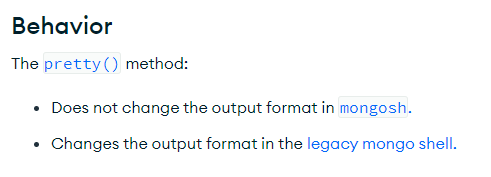

# 쿼리

## find()

컬렉션에서 조건에 맞는 문서를 조회합니다. 첫번째 매개변수에 조건을 전달할 수 있습니다.

mongosh에서는 20개까지 출력됩니다.

```shell
db.users.insertMany([ { "name": "John", "age": 20 }, { "name": "John", "age": 21 }, { "name": "Mike", "age": 22 }])

db.users.find({name: "John", age: 20})
# 결과
[
  { _id: ObjectId('65e27986600af4f84fc29167'), name: 'John', age: 20 }
]
```

두번째 매개변수로 출력할 필드를 지정할 수 있습니다. 

`_id`는 기본적으로 지정하지 않아도 출력됩니다. (`"_id": 0`으로 지정하면 출력되지 않습니다.)

```shell
db.users.find({name: "John", age: 20}, {"age" : 1 })
# 결과
[
  { _id: ObjectId('65e27986600af4f84fc29167'), age: 20 }
]

db.users.find({name: "John", age: 20}, {"_id" : 0 })
# 결과
[ { name: 'John', age: 20 } ]
```

**pretty()**

`레거시 mongo 쉘`에서는 `db.users.find().pretty()` 사용시 출력 형식을 변경하지만 `mongosh`에서는 출력 형식을 변경하지 않습니다.

`mongosh`에서는 기본적으로 결과가 어느 정도 가독성 있는 형태로 출력됩니다.



### findOne()

컬렉션에서 찾을 수 있는 첫번째 문서를 반환합니다. 쿼리 도큐먼트 형태로 조건 전달도 가능합니다.

<br>

## 쿼리 조건

### 쿼리 조건절

`< ($lt)`, `<= ($lte)`, `> ($gt)`, `>= ($gte)`, `!= ($ne)` 등의 연산자를 사용할 수 있습니다.

```shell
db.users.findOne({age: {$gt: 19}})
# 결과
{ _id: ObjectId('65e27986600af4f84fc29167'), name: 'John', age: 20 }

db.users.find({age: {$gt: 30}})
# 결과 - 공백

db.user.findOne({age: {$gte: 30}})
# 결과
null

db.users.find({age: {$ne: 20}})
# 결과
[
  { _id: ObjectId('65e27986600af4f84fc29168'), name: 'John', age: 21 },
  { _id: ObjectId('65e27986600af4f84fc29169'), name: 'Mike', age: 22 }
]
```

### OR 쿼리

OR 쿼리에는 두가지 방법이 있는데 `$in`, `$or` 연산자를 사용하는 방법입니다.

`$in`은 하나의 키를 여러 값으로 비교할 때 사용합니다.

`$nin`은 `$in`의 반대로 배열 내 조건과 일치하지 않는 도큐먼트를 반환합니다.

```shell
db.users.find({name: {$in: ["John", "Mike"]}})
# 결과
[
  { _id: ObjectId('65e27986600af4f84fc29167'), name: 'John', age: 20 },
  { _id: ObjectId('65e27986600af4f84fc29168'), name: 'John', age: 21 },
  { _id: ObjectId('65e27986600af4f84fc29169'), name: 'Mike', age: 22 }
]

db.users.find({age: {$nin: [20, 22]}})
# 결과
[
  { _id: ObjectId('65e27986600af4f84fc29168'), name: 'John', age: 21 }
]
```

`$or`은 여러 조건을 비교할 때 사용합니다. 다른 조건절도 포함할 수 있습니다.


```shell
db.users.find({$or: [{name: "John"}, {age: 22}]})
# 결과
[
  { _id: ObjectId('65e27986600af4f84fc29167'), name: 'John', age: 20 },
  { _id: ObjectId('65e27986600af4f84fc29168'), name: 'John', age: 21 },
  { _id: ObjectId('65e27986600af4f84fc29169'), name: 'Mike', age: 22 }
]

db.users.find({$or: [{name: "Mike"}, {age: {$in: [20, 21]}}]})
# 결과
[
  { _id: ObjectId('65e27986600af4f84fc29167'), name: 'John', age: 20 },
  { _id: ObjectId('65e27986600af4f84fc29168'), name: 'John', age: 21 },
  { _id: ObjectId('65e27986600af4f84fc29169'), name: 'Mike', age: 22 }
]
```

**쿼리 최적화**

AND 쿼리에서는 가능한 한 조건을 구체적으로 만들어서 검색 범위를 좁히는 것이 성능에 좋습니다. 왜냐하면 검색해야 할 문서의 수가 줄어들기 때문입니다.

OR쿼리는 반대로 첫 번째 조건이 많은 문서와 일치할수록, MongoDB가 더 많은 문서를 빨리 찾을 수 있으므로 효율적입니다.

`$or` 대신 `$in`을 사용하는 것이 좋습니다. 옵티마이저가 $in을 사용할 때 내부적으로 최적화를 수행하여 더 빠르고 효율적으로 데이터를 찾을 수 있습니다.


### $not

`$not`은 정규 표현식과 함께 사용해 주어진 패턴과 일치하지 않는 도큐먼트를 찾을 때 유용합니다.

```shell
 # 나이를 2로 나눴을 때 나머지가 1인 
db.users.find({"age" : {"$mod" : [2, 1]}})
# 결과
[
  { _id: ObjectId('65e27986600af4f84fc29168'), name: 'John', age: 21 }
]

# 나이를 2로 나눴을 때 나머지가 1이 아닌
db.users.find({"age" : {"$not" : {"$mod": [2, 1]}}})
# 결과
[
  { _id: ObjectId('65e27986600af4f84fc29167'), name: 'John', age: 20 },
  { _id: ObjectId('65e27986600af4f84fc29169'), name: 'Mike', age: 22 }
]
```

<br>

## 형 특정 쿼리

형 특정 쿼리(type-specific query)는 데이터 타입에 특화된 쿼리를 의미합니다.

특정 데이터 타입의 값을 대상으로 하는 연산이나 비교를 수행할 때 사용되는 쿼리입니다.

### null

null은 존재하지 않는 값입니다. 만약 null을 조건으로 쿼리하게 되면 해당 키가 존재하지 않는 도큐먼트도 반환됩니다.

```shell
db.users.find({"address": null})
# 결과
[
  {
    _id: ObjectId('65e27986600af4f84fc29167'),
    name: 'John',
    age: 20,
    address: null
  },
  { _id: ObjectId('65e27986600af4f84fc29168'), name: 'John', age: 21 },
  { _id: ObjectId('65e27986600af4f84fc29169'), name: 'Mike', age: 22 }
]
```

값이 null인 도큐먼트만 반환하려면 `$eq` 연산자를 사용합니다.

```shell
db.users.find({"address" : {"$eq": null, "$exists": true}})
# 결과
[
  {
    _id: ObjectId('65e27986600af4f84fc29167'),
    name: 'John',
    age: 20,
    address: null
  }
]
```

### 정규 표현식

`$regex` 연산자를 사용하여 정규 표현식을 사용할 수 있습니다. 

```shell
db.users.find({name: {$regex: /J/}})
# 결과
[
  { _id: ObjectId('65e27986600af4f84fc29167'), name: 'John', age: 20 },
  { _id: ObjectId('65e27986600af4f84fc29168'), name: 'John', age: 21 }
]

# /J?/는 'J' 문자가 0회 또는 1회 등장하는 문자열에 일치한다는 의미입니다
db.users.find({"name" : /J?/})
# 결과
[
  { _id: ObjectId('65e27986600af4f84fc29167'), name: 'John', age: 20 },
  { _id: ObjectId('65e27986600af4f84fc29168'), name: 'John', age: 21 },
  { _id: ObjectId('65e27986600af4f84fc29169'), name: 'Mike', age: 22 }
]

# /JO?/는 J는 포함하되 'O' 문자가 0회 또는 1회 등장하는 문자열에 일치한다는 의미입니다
db.users.find({"name" : /Jo?/})
# 결과
[
  { _id: ObjectId('65e27986600af4f84fc29167'), name: 'John', age: 20 },
  { _id: ObjectId('65e27986600af4f84fc29168'), name: 'John', age: 21 }
]
```

접두사 정규 표현식 쿼리(`^John`)에 인덱스를 활용할 수 있어 쿼리를 더 빠르게 수행할 수 있습니다.

> `^ (caret)`는 문자열이 시작하는 위치에서의 일치를 나타냅니다.
> 
> `^Jo`은 'Jo'로 시작하는 모든 문자열에 일치합니다. (대소문자를 구분합니다)
> 대소문자를 구별하지 않으려면 `i` 옵션을 사용합니다. `/^Jo/i`

### 배열에 쿼리하기

**$all**

`$all`은 배열 내 모든 요소가 일치하는 도큐먼트를 찾을 때 사용합니다.

배열 안에 순서는 중요하지 않습니다.

```shell
db.food.insertMany([ { "name": "apple", "tags": ["fruit", "red", "green"] }, { "name": "banana", "tags": ["fruit", "yellow"] }, { "name": "grape", "tags": ["fruit", "red", "green"] }])
[
  {
    _id: ObjectId('65e29b91600af4f84fc2916a'),
    name: 'apple',
    tags: [ 'fruit', 'red', 'green' ]
  },
  {
    _id: ObjectId('65e29b91600af4f84fc2916b'),
    name: 'banana',
    tags: [ 'fruit', 'yellow' ]
  },
  {
    _id: ObjectId('65e29b91600af4f84fc2916c'),
    name: 'grape',
    tags: [ 'fruit', 'red', 'green' ]
  }
]

db.food.find({tags: {$all: ["fruit", "red"]}})
# 결과
[
  {
    _id: ObjectId('65e29b91600af4f84fc2916a'),
    name: 'apple',
    tags: [ 'fruit', 'red', 'green' ]
  },
  {
    _id: ObjectId('65e29b91600af4f84fc2916c'),
    name: 'grape',
    tags: [ 'fruit', 'red', 'green' ]
  }
]

# 정확하게 일치하는 배열을 찾는 방법 - all 연산자를 사용하지 않습니다.
db.food.find({tags: ["fruit", "red", "green"]})
[
  {
    _id: ObjectId('65e29b91600af4f84fc2916a'),
    name: 'apple',
    tags: [ 'fruit', 'red', 'green' ]
  },
  {
    _id: ObjectId('65e29b91600af4f84fc2916c'),
    name: 'grape',
    tags: [ 'fruit', 'red', 'green' ]
  }
]

db.food.find({tags: ["red", "green", "fruit"]})
# 결과 - 없음

db.food.find({tags: ["fruit", "red"]})
# 결과 - 없음

# 인덱스로 배열 쿼리하기 - 인덱스 1번째 요소가 'red'인 도큐먼트를 찾습니다.
db.food.find({"tags.1": "red"})
# 결과
[
  {
    _id: ObjectId('65e29b91600af4f84fc2916a'),
    name: 'apple',
    tags: [ 'fruit', 'red', 'green' ]
  },
  {
    _id: ObjectId('65e29b91600af4f84fc2916c'),
    name: 'grape',
    tags: [ 'fruit', 'red', 'green' ]
  }
]
```

### $size

특정 크기의 배열을 찾을 때 사용합니다.

```shell
db.food.find({tags: {$size: 2}})

# 결과
[
  {
    _id: ObjectId('65e29b91600af4f84fc2916b'),
    name: 'banana',
    tags: [ 'fruit', 'yellow' ]
  }
]
```

`$size`는 다른 $조건절(예: $gt, $lt)과 함께 사용할 수 없습니다. 그러나 도큐먼트에 size 필드를 추가하여 배열의 크기를 저장하고 쿼리할 수 있습니다.

단점은 `$addToSet` 연산자와는 함께 사용할 수 없습니다. (중복이 있는 경우 반환되는 size와 실제 배열의 크기가 다를 수 있기 때문입니다.)

```shell
db.food.update({tags: {$size: 2}}, {"$push" : {"friend" :"watermelon"}, "$inc" : {"size" : 1}})
db.food.update({tags: {$size: 2}}, {"$push" : {"friend" :"apple"}, "$inc" : {"size" : 1}})
# 결과
{
  _id: ObjectId('65e29b91600af4f84fc2916b'),
  name: 'banana',
  tags: [ 'fruit', 'yellow' ],
  friend: [ 'watermelon', 'apple' ],
  size: 2
}

# 다른 $조건절 적용
db.food.find({size: {$gt: 1}})
# 결과
[
  {
    _id: ObjectId('65e29b91600af4f84fc2916b'),
    name: 'banana',
    tags: [ 'fruit', 'yellow' ],
    friend: [ 'watermelon', 'apple' ],
    size: 2
  }
]
```

### $slice

`$slice`는 배열의 일부 요소를 반환할 때 사용합니다. 뒤에서 반환할 때는 음수를 사용합니다.

```shell
{
  _id: ObjectId('65e2a234600af4f84fc2916d'),
  type: 'notice',
  likes: 1,
  comments: [ 'a', 'b', 'c', 'd', 'e', 'f' ]
}

db.posts.findOne({"_id": ObjectId('65e2a234600af4f84fc2916d')}, {"comments" : {"$slice" : 1}})
# 결과
{
  _id: ObjectId('65e2a234600af4f84fc2916d'),
  type: 'notice',
  likes: 1,
  comments: [ 'a' ]
}

db.posts.findOne({"_id": ObjectId('65e2a234600af4f84fc2916d')}, {"comments" : {"$slice" : -1}})
# 결과
{
  _id: ObjectId('65e2a234600af4f84fc2916d'),
  type: 'notice',
  likes: 1,
  comments: [ 'f' ]
}

# 오프셋과 요소 개수를 지정해 원하는 범위 안에 있는 결과를 반환할 수 있습니다.
db.posts.findOne({"_id": ObjectId('65e2a234600af4f84fc2916d')}, {"comments" : {"$slice" : [3, 5]}})
{
  _id: ObjectId('65e2a234600af4f84fc2916d'),
  type: 'notice',
  likes: 1,
  comments: [ 'd', 'e', 'f' ]
}
```

**일치하는 배열 요소 반환**

각 도큐먼트에서 첫번째로 일치하는 요소만 반환합니다.

```shell
[
  {
    _id: ObjectId('65e2a234600af4f84fc2916d'),
    type: 'notice',
    likes: 1,
    comments: [
      { name: 'sard', email: '1abc@' },
      { name: 'sard', email: '2abc@' },
      { name: 'ad', email: '2abc@' },
      { name: 'ad', email: '3abc@' }
    ]
  }
]

db.posts.find({"comments.name" : "ad"}, {"comments.$" : 1 })
# 결과
[
  {
    _id: ObjectId('65e2a234600af4f84fc2916d'),
    comments: [ { name: 'ad', email: '2abc@' } ]
  }
]
```


`db.test.find({"x" : {"$gt" : 10, "$lt" : 20}})`를 하면 의도치 않게 `{"x" : [5, 25]}`가 반환된다. 

5, 25 둘다 10과 20 사이는 아니지만 25는 첫번째 절과 일치하고 5는 두번째 절과 일치하기 때문입니다.

우리가 원하는 방식은 10보다 크고 20보다 작은 배열을 찾는 것입니다.

**$elemMatch**

첫번째 방법으로 `$elemMatch`를 사용할 수 있습니다. 

`$elemMatch`을 사용하면 두 절을 하나의 배열 요소와 비교하게 됩니다. 단점은 비배열 요소를 비교할 때는 사용할 수 없습니다.

```shell
[
  { _id: ObjectId('65e2e1e09cd7e3bc59771f16'), a: [ 25, 5 ] },
  { _id: ObjectId('65e2e1e09cd7e3bc59771f17'), a: 10 }
]

db.abcs.find({"a" : {"$gt" : 9, "$lt" : 20}})
# 결과
[
  { _id: ObjectId('65e2e1e09cd7e3bc59771f16'), a: [ 25, 5 ] },
  { _id: ObjectId('65e2e1e09cd7e3bc59771f17'), a: 10 }
]

db.abcs.find({"a" : {"$elemMatch" : {"$gt" : 3, "$lt" : 26}}})
# 결과
[ { _id: ObjectId('65e2e1e09cd7e3bc59771f16'), a: [ 25, 5 ] } ]
```

필드에 인덱스가 있다면 min, max 함수를 사용해 범위를 제한할 수 있습니다. (min, max 함수는 특정 필드에 대한 인덱스를 필요로 합니다.)

인덱스를 생성할 때, 인덱스 키 값으로 사용될 수 있는 값은 1(오름차순), -1(내림차순), 그리고 다른 특수한 값들입니다.\

hint는 쿼리를 실행할 때 사용할 인덱스를 명시적으로 지정할 수 있습니다.

```shell
db.abcs.createIndex({"a": 1}) # 오름차순 인덱스

db.abcs.find({"a" : {"$gt" : 9, "$lt" : 20}}).min({"a" : 9}).max({"a": 20}).hint({"a": 1})
# 결과
[ { _id: ObjectId('65e2e1e09cd7e3bc59771f17'), a: 10 } ] 

# 배열도 조건에 맞으면 반환됩니다.
db.abcs.find({"a" : {"$gt" : 1, "$lt" : 100}}).min({"a" : 1}).max({"a": 100}).hint({"a": 1})
# 결과
[
  { _id: ObjectId('65e2e1e09cd7e3bc59771f16'), a: [ 25, 5 ] },
  { _id: ObjectId('65e2e1e09cd7e3bc59771f17'), a: 10 }
]
```

**배열 포함 도큐먼트 범위 최적화**

배열을 포함하는 도큐먼트에 범위 쿼리를 할 때 min함수와 max 함수를 사용하면 쿼리 성능을 개선할 수 있습니다.

배열을 포함하는 도큐먼트에 대해 $gt (초과), $lt (미만) 같은 범위 쿼리를 사용할 때 데이터베이스는 배열의 각 요소를 순회하면서, 
각 요소가 쿼리 조건에 부합하는지를 확인합니다. 배열 내의 모든 값에 대해서 인덱스를 검사하게 되므로 비효율적일 수 있습니다. 

반면에 min 함수와 max 함수를 사용하면, 쿼리가 특정 범위 내의 값들에만 초점을 맞출 수 있습니다.

### 내장 도큐먼트 쿼리

```shell
{
  _id: ObjectId('65e2e8779cd7e3bc59771f18'),
  name: { first: 'Joe', last: 'woo' },
  age: 20
}

db.users.find({"name" : {"first" : "Joe", "last" : "woo"}})
# 결과
[
  {
    _id: ObjectId('65e2e8779cd7e3bc59771f18'),
    name: { first: 'Joe', last: 'woo' },
    age: 20
  }
]

# 단점 - 순서를 따짐
db.users.find({"name" : {"last" : "woo", "first" : "Joe"}})
# 결과 없음
```

순서를 따지기 때문에 내장 도큐먼트에 쿼리할 때는 특정 키로 쿼리하는 것이 좋습니다. (점 표기법)

```shell
db.users.find({"name.last" : "woo", "name.first" : "Joe"})
# 결과
[
  {
    _id: ObjectId('65e2e8779cd7e3bc59771f18'),
    name: { first: 'Joe', last: 'woo' },
    age: 20
  }
]

```

```shell
db.blog.find()
[
  {
    _id: ObjectId('65e2eca69cd7e3bc59771f1a'),
    content: '...',
    comments: [
      { author: 'joe', score: 3, comment: 'nice post' },
      { author: 'mary', score: 6, comment: 'terrible post' }
    ]
  }
]
db.blog.find({"comments" : {"author" : "joe", "score" : {"$gte" : 1}}})
# 결과 없음 - 내장 도큐먼트가 쿼리 도큐먼트 전체와 일치해야함 (comment가 없음)
 
db.blog.find({"comments.author" : "joe", "comments.score" : {"$gte" : 5}})
# 결과 - score 조건과 author 조건이 배열 내 각기 다른 도큐먼트와 일치함
[
  {
    _id: ObjectId('65e2eca69cd7e3bc59771f1a'),
    content: '...',
    comments: [
      { author: 'joe', score: 3, comment: 'nice post' },
      { author: 'mary', score: 6, comment: 'terrible post' }
    ]
  }
]
```

모든 키를 지정하지 않고 조건을 정확하게 묶으려면 `$elemMatch`를 사용해야합니다. 

`$elemMatch`는 조건을 그룹화하여 내장 도큐먼트에서 2개 이상의 키 조건 일치여부를 확인할 때 사용합니다.

```shell
db.blog.find({"comments" : {"$elemMatch" : {"author" : "joe", "score" : {"$gte" : 5}}}})
# 결과 - 없음

db.blog.find({"comments" : {"$elemMatch" : {"author" : "joe", "score" : {"$gte" : 1}}}})
# 결과 - 해당 조건을 만족하는 요소가 하나라도 포함된 전체 문서를 반환합니다.
[
  {
    _id: ObjectId('65e2eca69cd7e3bc59771f1a'),
    content: '...',
    comments: [
      { author: 'joe', score: 3, comment: 'nice post' },
      { author: 'mary', score: 6, comment: 'terrible post' }
    ]
  }
]

db.blog.find({"comments": {"$elemMatch": {"author": "joe", "score": {"$gte": 1}}}}, {"content": 1, "comments.$": 1})
# 결과
[
  {
    _id: ObjectId('65e2eca69cd7e3bc59771f1a'),
    content: '...',
    comments: [ { author: 'joe', score: 3, comment: 'nice post' } ]
  }
]
```

### $where

`$where` 절을 사용해 자바스크립트 함수를 사용해 거의 모든 쿼리를 표현할 수 있습니다. 따라서 보안상 이유로 `$where`를 사용하는 것은 피하는 것이 좋습니다.

`$where` 절에 제공된 자바스크립트 함수를 각 문서에 대해 개별적으로 실행해야 하므로, 인덱스를 이용한 최적화가 불가능하게 됩니다. (성능 저하)

반드시 필요한 경우가 아니면 사용하지 않는 것이 좋습니다.

3.6에서 `$expr`이 추가되었기 때문에 가능한 `$where` 대신 `$expr`을 사용하는 것이 좋습니다.

```shell
db.food.insertOne({"apple" : 1, "banana" : 6, "grape" : 3})
db.food.insertOne({"apple" : 8, "spinach" : 4, "watermelon" : 4})
[
  {
    _id: ObjectId('65e2f0179cd7e3bc59771f1b'),
    apple: 1,
    banana: 6,
    grape: 3
  },
  {
    _id: ObjectId('65e2f01a9cd7e3bc59771f1c'),
    apple: 8,
    spinach: 4,
    watermelon: 4
  }
]

db.food.find({$where: function() {
  for (var current in this) {
    for (var other in this) {
      if (current != other && this[current] == this[other]) {
        return true;
      }
    }
  }
  return false;
}})
# 결과 - true 반환시 해당 도큐먼트는 결과셋에 포함, false는 결과셋에 포함되지 않음
[
  {
    _id: ObjectId('65e2f01a9cd7e3bc59771f1c'),
    apple: 8,
    spinach: 4,
    watermelon: 4
  }
]
```

해당 함수는 도큐먼트의 모든 키를 순회하면서 같은 값을 가진 키가 있는지 확인합니다. 예시에서는 `spinach`와 `watermelon`이 같은 값을 가지고 있기 때문에 결과에 포함됩니다.

### 커서

데이터베이스는 커서를 사용해서 find의 결과를 반환합니다. 

자바스크립트 반복자 forEach를 사용해 커서를 반복할 수 있습니다.

커서는 조건에 일치하는 결과를 모두 살펴보거나 유효 영역을 벗어나거나 10분 동안 활동이 없으면(타임아웃) 자동으로 닫힙니다.

커서를 타임아웃시키지 못하게하는 immortal 함수가 있습니다. 이때는 반드시 결과를 모두 살펴보거나 커서를 꼭 종료해야합니다. 그렇지 않으면 서버가 재시작할 때까지 리소스를 차지합니다.

```shell
var cursor = db.users.find()

if (cursor.hasNext()) { printjson(cursor.next()); }
# 결과
{
  _id: ObjectId('65e2e8779cd7e3bc59771f18'),
  name: {
    first: 'Joe',
    last: 'woo'
  },
  age: 20
}

if (cursor.hasNext()) { printjson(cursor.next()); }
# 결과
{
  _id: ObjectId('65e2e9d29cd7e3bc59771f19'),
  name: {
    first: 'Tae',
    last: 'woo'
  },
  age: 21
}

if (cursor.hasNext()) { printjson(cursor.next()); }
# 결과 - 없음
```

find를 호출할 때 셸이 데이터베이스를 즉시 쿼리하지 않으며 결과를 요청하는 쿼리를 보낼때까지 기다립니다. 따라서 쿼리하기전 옵션을 추가할 수 있습니다.

```shell
var cursor = db.users.find().sort({"age" : 1}).limit(1).skip(1) # 이 시점에 쿼리는 수행되지 않습니다.

cursor.hasNext() # 이 시점에 쿼리가 수행됩니다. (next, hasNext 호출시 수행됨)
```

limit(1)은 결과를 1개만 반환하도록 합니다.

skip(1)은 결과에서 첫번째 도큐먼트를 제외하고 반환합니다.

sort는 1(오름차순), -1(내림차순)으로 정렬합니다. 키가 여러개면 주어진 정렬 방향에 따라 정렬됩니다.

주의할 점은 큰 수를 건너뛰면 비효율적입니다. (skip(100000)은 100000개의 도큐먼트를 건너뛰어야 하므로 비효율적입니다.)

### 많은 수 건너뛰기 피하기

limit를 사용하지않고 날짜를 기준으로 건너뛰기를 피할 수 있습니다.

```shell
latest = new Date("2022-01-01") # 가져온 마지막 도큐먼트의 date 값 사용 가정

db.food.find({"date" : {"$lt" : latest}}).sort({"date" : -1}).limit(100)
```

### 콜렉션 랜덤으로 가져오기

컬렉션에서 랜덤 요소를 찾아야 한다면 도큐먼트에 랜덤키를 추가하는 방법을 사용할 수 있습니다.

```shell
db.food.insertOne({"_id" : 1, "name" : "apple", "random" : Math.random()})

# 로직
var random = Math.random()

db.food.findOne({"random" : {"$gte" : random}}) # random보다 큰 값 중 가장 작은 값
```
